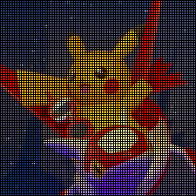
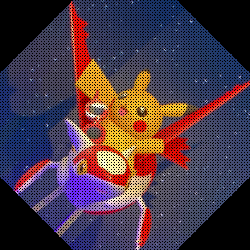

# 語句課題
- 画像をその場で変形するには，どのような発想が必要か．3ステップを書け
- 線形変換
	- 意味を書くこと
- 拡大・縮小処理
	- 式を書くこと
- 回転
	- 式を書くこと
- 鏡映（reflection）
	- x軸に関して
		- 変換の式を書くこと
		- その結果，画像はどのように変化するか
	- y=x軸に関して
		- 変換の式を書くこと
		- その結果，画像はどのように変化するか
- スキュー
	- 変換の式を書くこと
	- その結果，画像はどのように変化するか
- 合成変換
	- 意味を書くこと
- 平行移動
	- 変換の式を書くこと
	- その結果，画像はどのように変化するか
- 同次座標
	- 座標x, yとの関係式を書くこと
- アフィン変換
	- 意味を書くこと
	- 式を書くこと
- ユークリッド変換
	- 意味を書くこと
	- 式を書くこと
- 相似変換
	- 意味を書くこと
	- 式を書くこと

# プログラム課題
次のプログラムをPythonを用いて開発し，提出せよ．ただし提出時には拡張子を「.py」から「.txt」へ書き換えて提出すること

- ファイル名：`kadai06.py`（ただし提出時は拡張子を.txtへリネームすること）
- 実行時は次のコマンドによること
    - [凡例] `$ python kadai06.py <入力画像ファイル名> <拡大率> <縮小率> <回転角度（ラジアン）> <スキューのパラメタθ（ラジアン）> <平行移動tx[px]> <平行移動ty[px]>`
    - [サンプル] `$ python kadai06.py sample.png 1.5 0.8 0.79 0.79 30 50`
- 出力時，次の画像ファイルを全て出力すること．元画像は必要に応じて0埋め処理を施し，画像サイズは変わらないようにすること．
    1. `img01_kakudai.png`：拡大率に合わせて画像を拡大
    2. `img02_syukusyo.png`：縮小率に合わせて画像を縮小
    3. `img03_kaiten.png`：回転角度によって画像を回転
    4. `img04_kyoei.png`：直線y=xで鏡映
    5. `img05_sukyu.png`：x軸方向へスキュー．式は`x' = x + tan(θ)·y`, `y' = y`に従う．θを指定する．
    6. `img06_heiko.png`：パラメタに応じて平行移動
- その他の条件を下記に示す
	- **画像の中心を原点（基準点）とする**こと．OpenCVで読み込んだ画像は画像の左上が原点となる．今回はそうではないので注意すること
	- 正の角度は時計回りとする
	- 変形先の座標が小数となる場合は，四捨五入した座標を用いること
	- 書き込み先の座標が衝突する場合，後勝ち（より後のものでそのまま上書き）処理すること
	- 参考として，データが書き込まれないことによる縞は仕様上発生する可能性がある
	- 入力は正方形の画像を前提とする（長方形の画像は考慮する必要はない）
	- 処理フローは下記に従うこと．変形処理自体はOpenCV等の関数を使うのではなく，処理は手作業で実装すること
```text
  1. 元画像を読み込む
  2. 元画像と同サイズの3chな黒い画像を（変数としてプログラム内部に）用意する．
  3. 画像処理する
    3.1 元画像のx軸に関するループ
      3.1.1 元画像のy軸に関するループ
        3.1.1.1 ある1画素に対して，変換先の座標を求める．
        3.1.1.2 その座標に「ある1画素」のデータをコピーする
  4. 画像を保存する
```
- 参考
	1. 下記にsample.pngを入力した際に出力を期待する画像群を示す．
	2. [kadai03_sample.py](kadai03_sample.py)に，処理未記入のプログラムサンプルを示す．このサンプルを活用しても良いし，しなくても良い

<table><tr><td><br>sample.png</td></tr></table>

<table>
<tr><td><br>img01_kakudai.png</td><td><br>img02_syukusyo.png<br></td><td><br>img03_kaiten.png</td></tr>
<tr><td><br>img04_kyoei.png</td><td><br>img05_sukyu.png</td><td><br>img06_heiko.png</td></tr>
</table>